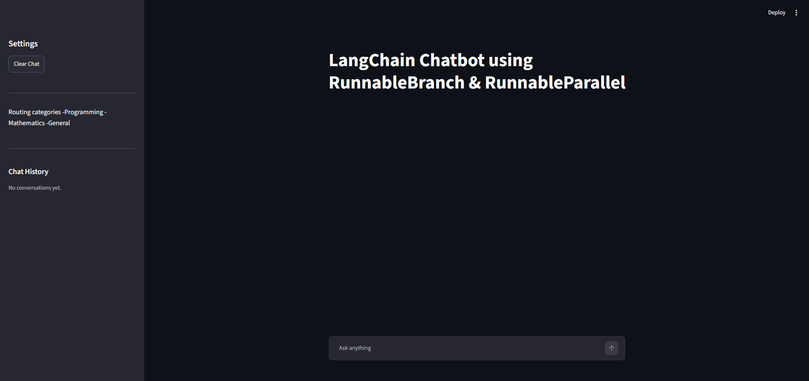
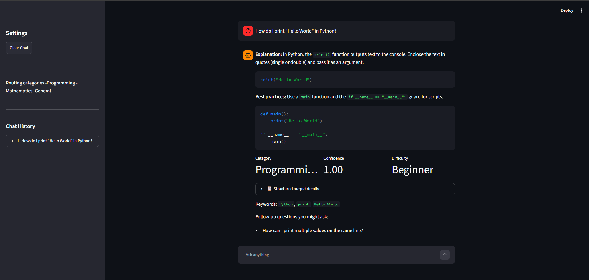
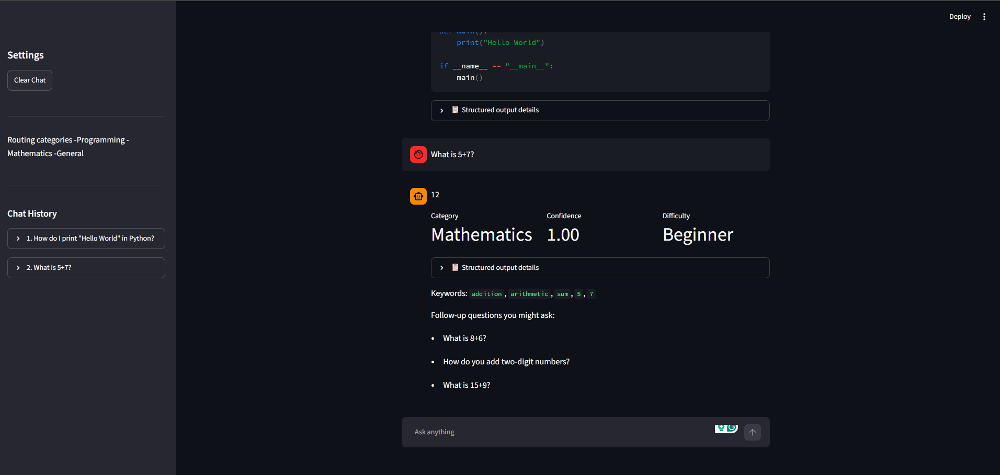

# LangChain Chatbot — RunnableBranch & RunnableParallel

A Streamlit-based AI chatbot built with the latest LangChain LCEL APIs, demonstrating
`RunnableBranch`, `RunnableParallel`, and Pydantic-validated structured output.

## Features

- 🔀 **Query routing** — every question is classified as Programming, Mathematics, or
  General and sent to a dedicated prompt/persona via `RunnableBranch`.
- ⚡ **Parallel generation** — the main answer and a summary/difficulty/follow-up-questions
  block are produced together via `RunnableParallel`.
- ✅ **Structured output** — all model output is validated against Pydantic `BaseModel`
  schemas (no bare `StrOutputParser` for final answers).
- 💬 **Streamlit chat UI** — persistent chat history, structured-output viewer, and a
  Clear Chat button.
- 🔑 **Secure config** — API keys are loaded from a `.env` file, never hardcoded.

## Project Structure

```
project/
├── app.py
├── chatbot.py
├── prompts.py
├── schemas.py
├── requirements.txt
├── .env.example
└── README.md
```

## RunnableBranch Implementation

`chatbot.py` uses a single `ChatGroq` model throughout. A simple classifier chain
(`classifier_prompt | model | parser`) categorizes the incoming question as
`programming`, `mathematics`, or `general`. `RunnableBranch` then picks the matching
prompt/persona chain:

```python
answer_branch = RunnableBranch(
    (lambda x: x["category"] == "programming", programming_chain),
    (lambda x: x["category"] == "mathematics", math_chain),
    general_chain,  
)
```

## RunnableParallel Implementation

Once the branch produces the main `ChatResponse`, `RunnableParallel` runs a second
chain (summary/difficulty/follow-ups) using the same question, returning both results
together:

```python
parallel_chain = RunnableParallel(
    chat_response=lambda x: x["chat_response"],
    summary_response=summary_chain,
)
```

## Pydantic Structured Output Implementation

Three schemas live in `schemas.py`:

- `ChatResponse` — `answer`, `category`, `confidence`, `keywords`
- `SummaryResponse` — `summary`, `difficulty_level`, `follow_up_questions`
- `FinalChatOutput` — the merged object rendered in the UI

The LLM is bound with `.with_structured_output(<Schema>)` so every generation is
validated, rather than parsed from raw text with `StrOutputParser`.

## Installation

1. Clone the repository and enter the project folder.
2. Create and activate a virtual environment (recommended):
   ```bash
   python -m venv venv
   source venv/bin/activate 
   ```
3. Install dependencies:
   ```bash
   pip install -r requirements.txt
   ```
4. Copy `.env.example` to `.env` and add your Groq API key:
   ```bash
   cp .env.example .env
   ```
5. Run the app:
   ```bash
   streamlit run app.py or python streamlit run app.py
   ```

## Screenshots

### Chatbot UI



### Programming


### Mathematics


### General
